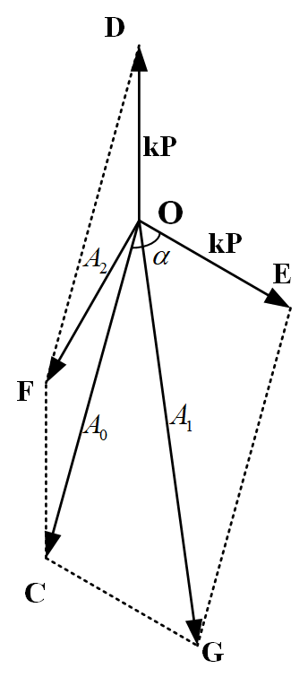

# 刚性转子的三点式动平衡方法

过去在测振仪器落后的年代，或者在没有测相设备的情况下，针对刚性转子的动平衡，只能采用测振幅法。而三点法则是测振幅法中最为常用的一种。由于现代测振仪器的进步，测振幅法已经逐步被弃用，而影响系数法被更多的用于动平衡。因此，绝大多数动平衡资料都已不再介绍测振幅法或三点法，介绍三点法原理的资料更是少之又少，导致我对三点法的原理颇为好奇从而进行了一番研究。现将个人对三点式动平衡方法原理的理解与诸君分享。

## 三点式动平衡方法

以下引述施维新专家在《汽轮发电机组振动及事故》中对三点法动平衡的原文。

>**三点法**是现场常用的一种测量振幅求平衡重量方向的方法，它首先将加重的端面分成**三等分**（也可以不等分），分别编为1、2、3号（注意编号顺序与转子转动方向的关系）。然后进行第一次启动，测取原始振幅$A_0$，选取试加重量P，分别置于端面1、2、3点上，测取试加重后轴承振幅$A_{01}$、$A_{02}$、$A_{03}$，再做图求取应加重的大小和方向，具体步骤如下：
>
>1. **以 $O$ 为中心，引出三条与端面编号相应的辐射线**，若端面是三等分，则每条线之间的夹角为120°。
>2. **以O为圆心，以原始振幅 $A_0$（一般放大1000倍）为半径**，画圆并与三条辐射线交于 $S_1$、$S_2$、$S_3$。注意，$S_1$、$S_2$、$S_3$ 的编号与转子端面上的编号顺序和转子转动方向必须符合。
>3. **以 $S_1$ 为圆心，以 $A_{01}$（与 $A_0$ 相同的放大比例）为半径画圆**。按此顺序，以 $S_2$、$S_3$ 为圆心，以 $A_{02}$、$A_{03}$ 为半径，分别画圆，**三个圆交于 $B$ 点**，$OB$ 方向即转子应加平衡重量方向，如图1所示。实际作图时，由于振幅测量误差，三个圆往往不能交于同一点，构成一个三角形，在这种情况下，可以**取三角图1三点法求平衡重量方向形中心点（平均值）**。
>4. 按作图的比例尺，反求出 $OB$ 相对应的振幅值 $A_1$，$A_1$ 即为**试加重量 $P$ 引起的振幅**。
>5. 应加平衡重量 $Q$ 可计算如下，即
>$$Q=A_0P/A_1$$
>6. 加重方向的确定。如图所示，由 $S_1$ 为起点，顺转 $\theta$ 角，即为应加平衡重量方向。

图1 三点法求平衡重量方向

## 两点法原理

### 理论前提

不管是两点法还是三点法，其前提假设包括：
- 转子为纯刚性转子，且振动与不平衡力之间无相对滞后。
- 转子系统为线性系统，则根据叠加原理，**多个不平衡力同时作用于系统的总输出振动，等于各输入单独不平衡力作用于系统的输出振动的矢量和**

不平衡力 $F=mr\omega^2$ ，因此，在相同转速、相同不平衡半径的情况下，转子振幅正比于不平衡质量，且同相，即 $A_u=kP$

### 两点法可行性分析

假设试重引起的振幅为 $A_p=kP$ ，两次试重重量为 $P$，对应的振幅为$A_1$、$A_2$，两次试重间的夹角为$\theta$，则根据图2的几何关系，应用余弦定理可得：
$$
\begin{array}{c}
A_p^2+A_0^2+2A_pA_0cos\alpha=A_1^2 \\
A_p^2+A_0^2+2A_pA_0cos(2\pi-\theta-\alpha)=A_2^2
\end{array}
$$
其中，$\theta$ 为 ∠DOE

这个关于 $A_p$ 和 $\alpha$ 的方程组并不好求，直接求解表达式比较困难，计算数值解更为合理。但我们可以进一步转化，使问题简化。

图2 两点法振幅合成分析

### 转化

我们将振幅的平行四边形合成法改为三角形合成法，将图2转变为图3的形式。于是，问题就转化为找出满足如下要求的四边形$OFCG$：

- **已知四边形相邻两边夹角为 $\theta$，且这两边相等**
- **另外两边长分别为$A_1$、$A_2$**
- **对角线（$OC$）长为 $A_0$**

对于这样的几何条件，我们很难通过作图法确定图形，因为四边形的四个点仅有一个点 $C$ 固定。

接下来就是重点，我们可以进一步变换图形。将 $A_0$ 和 $A_1$ 对调， $A_0$ 和 $A_2$ 对调，如下图所示：

图中，颜色相同代表长度相同，虚线代表原图形，实线代表变化后的图形。显然，$\triangle OCF \cong \triangle DCM$、$\triangle OCG \cong \triangle ECM$
**通过这样的变换后，CM方向就是原始不平衡力的反向，即应加重的方向，只是CM变成了加重引起的振幅。最重要的是，新四边形有三个点固定，即点 $CDE$ ，我们只需确定第四点M。**问题也转化为了新的几何问题，即：

- **已知四边形相邻两边（$CD$、$CE$）夹角为 $\theta$ ，这两边相等，边长为$A_0$**
- **另外两边长分别为$A_1$、$A_2$**

新问题由于**只需要确定点 $M$ 的位置**，变得非常简单。$DM$和$EM$都是一点确定，边长确定，而另一端点不确定，很容易就能联想到以固定点为圆心，确定边长为半径作圆。即以$D$为圆心，$A_2$为半径画圆，以$E$为圆心，$A_1$ 为半径画圆，两圆的交点，就能满足新问题的条件2。如下图所示。

==显然，**这就是两点作图法**！==

### 求两点法交点

我们可以以C为原点，CE为x轴正方向建立坐标系。显然，E点坐标为$(A_0, 0)$，设两次加重夹角为 $\theta$ ，则D点坐标为 $(A_{0}\cos\theta, A_{0}\sin\theta)$。设交点坐标为$(x,y)$，则交点满足如下方程组：

$$
\begin{equation}
\left\{
\begin{aligned}
(x-A_{0})^{2}+y^{2} &= A_{1}^{2} \quad \text{(1)} \\
(x-A_{0}\cos\theta)^{2}+(y-A_{0}\sin\theta)^{2} &= A_{2}^{2} \quad \text{(2)}
\end{aligned}
\right.
\end{equation}
$$

将(1)式减去(2)式，并整理得到：
$$(\cos\theta-1)x+\sin\theta\cdot y=\frac{A_{1}^{2}-A_{2}^{2}}{2A_{0}}=K$$

因此得到，$$y=\frac{K+(1-x\cos\theta)}{\sin \theta}$$

代入(1)式并整理得：

$$ax^2+bx+c=0$$
其中，

$$
\begin{equation}
\left\{
\begin{aligned}
a &= \frac{2}{1+\cos \theta} \\
b &= aK - 2A_0 \\
c &= \frac{K^2}{\sin^2\theta} + A_0^2 - A_1^2 
\end{aligned}
\right.
\end{equation}
$$

只需要按照求根公式即可求出交点。

## 三点法

显然，两点法在绝大多数情况下都有两个交点，误差较大。理论上通过三点法，可以使得三个圆交于一点，但实际操作过程中，三点法更多是取临近三点的几何中心，可以很大程度上减少误差。

### 三点法程序

按照上述的理论分析，采用PyQt5开发了三点法程序，可以规避手工作图引入的误差。程序界面如图：

使用效果如图：

